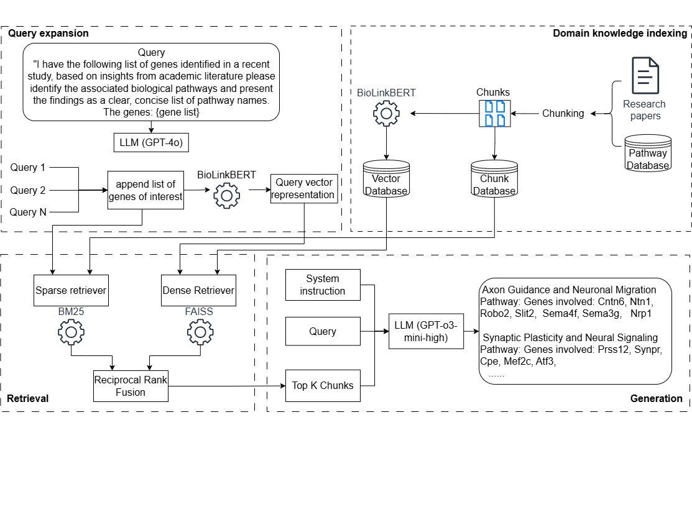

# Biomedical Literature Query Processor


## Table of Contents

- [Introduction](#introduction)
- [Features](#features)
- [Installation](#installation)
- [Configuration](#configuration)
- [Input and Output](#input-and-output)
- [Running the Application](#running-the-application)
- [Customization](#customization)
- [Code Structure](#code-structure)
- [Troubleshooting](#troubleshooting)
- [Contributing](#contributing)
- [License](#license)
- [Contact](#contact)

## Introduction

The **Modular RAG pipeline for LUMC** is a pipeline designed to facilitate information retrieval from biomedical literature using Retrieval-Augmented Generation (RAG). Leveraging natural language processing (NLP) techniques, embedding models, and efficient search algorithms, this tool provides accurate and relevant responses to user queries. 

The overview of the pipeline can be seen the in the figure below


## Features

- **Customizable Configurations:** Easily adjust settings and parameters through configuration files
- **PDF and Data Processing:** Extracts and processes information from PDFs and structured data files
- **Query Expansion:** Enhances user queries by generating related terms and synonyms using OpenAI's GPT-4o model
- **Search Algorithms:** Implements both FAISS for vector-based similarity search and BM25 for keyword-based ranking
- **Retrieval Augmented Generation**: A search engine to help answer your research questions by leveraging LLMs.


## Installation

### Prerequisites

- Python 3.8 or higher
- **pip** package manager

### Clone the Repository

```bash
git clone https://github.com/mghuibregtse/RAG_LUMC.git
cd RAG_LUMC
```

### Create a Virtual Environment (Recommended)

```bash
python -m venv venv
source venv/bin/activate  # On Windows: venv\Scripts\activate
```

### Install Dependencies

```bash
pip install -r requirements.txt
```

Some libraries like torch may require specific installation steps based on your system and hardware. Refer to the [PyTorch Installation Guide](https://pytorch.org/get-started/locally/) for detailed instructions.

## Configuration

All configurations are managed through JSON files located in the `./configs_system_instruction/` directory.

### Configuration Files

- Default Configuration: `default_config.json`
- GSEA Configuration: `GSEA.json`

### Key Configuration Parameters

- `query`: The user's search question
- `number_of_expansions`: Number of different versions of the query to generate
- `batch_size`: Number of documents to process in each batch
- `model`: Name of the transformer model to use for embeddings (see https://huggingface.co/ for different models.)
- `amount_docs`: Number of top documents to retrieve
- `weight_faiss`: Weight assigned to FAISS scores during ranking
- `weight_bm25`: Weight assigned to BM25 scores during ranking
- `system_instruction_response`: An instruction for the LLM to specify the input, output, structure.

### Environment Variables

Create a `.env` file in the root directory. Depending on which model you'd want to use, add different api keys.
Per different vendor for LLMs, check out the quick start, where you can create your own API key.
- [OpenAI](https://platform.openai.com/docs/quickstart)
- [Gemini](https://ai.google.dev/gemini-api/docs/quickstart?lang=python)
- [Anthropic](https://docs.anthropic.com/en/api/getting-started)

```bash
OPENAI_API_KEY=your_openai_api_key_here
GEMINI_API_KEY=your_gemini_api_key_here
ANTHROPIC_API_KEY=your_anthropic_api_key_here
```

## Input and Output

### Input Directories

- Configuration Files: `./configs_system_instruction/`
- Data Files: `./Data/GSEA/` (contains `.gmt.gz` and `.txt.gz` files)
- PDF Documents: `./Data/PDF/`
- Gene ID to Symbol Cache: `./Data/JSON/ncbi_id_to_symbol.json`

### Output Directories

- Database: `reference_chunks.db` (SQLite database storing document chunks)
- FAISS Index: `faiss_index.bin`
- Logs:
  - `./file_log/file_log.json`
  - `time.txt`
- Responses:
  - `answer.txt`
  - `documents.txt`
  - `scores.xlsx`
  - `unknown_genes.txt`

### Data Flow

1. Input Data: Data files and PDFs are ingested from the specified input directories
2. Processing:
   - Gene IDs are resolved and converted to symbols
   - Documents are chunked and embedded
   - Embeddings are stored in the FAISS index and SQLite database
3. Querying:
   - User queries are expanded
   - Relevant documents are retrieved using FAISS and BM25
   - Responses are generated using the GPT-4 model
4. Output: Responses and relevant scores are saved to output files

## Running the Application

### Prepare Your Data

Ensure that your data files are placed in the appropriate directories:
- `.gmt.gz` and `.txt.gz` files in `./Data/biomart/`
- PDF documents in `./Data/PDF/`

### Execute the Script

```bash
python your_script_name.py
```

Replace `your_script_name.py` with the actual name of your Python script.

### Monitoring Execution

Execution times for various functions are logged in `time.txt`. Check this file to monitor performance and identify potential bottlenecks.

## Customization

### Configuration Parameters

Adjust the following parameters in your configuration JSON files:

Query Settings:
- `query`: Modify the default search query
- `number_of_expansions`: Change the number of query expansions generated

Model Settings:
- `model`: Switch between different transformer models (e.g., bert-base-uncased, roberta-large)

Search Settings:
- `amount_docs`: Determine how many top documents to retrieve
- `weight_faiss` & `weight_bm25`: Adjust the weighting between FAISS and BM25 scores for ranking

Batch Processing:
- `batch_size`: Increase or decrease the number of documents processed per batch based on your system's capabilities

### Environment Variables

Update the `.env` file with your OpenAI API key and any other necessary environment variables.

### Extending Functionality

- Adding New Data Sources: Modify the `load_gz_files` and `load_pdf_files` functions to include additional data formats or sources
- Custom Embedding Models: Change the transformer model by updating the model parameter in the configuration and ensuring compatibility
- Adjusting Tokenization: Customize the `tokenize` function to include or exclude specific tokens or to change tokenization rules

## Code Structure

### Main Components

Data Processing:
- `process_excel_data()`
- `convert_gene_id_to_symbols()`
- `chunk_documents()`
- `chunk_pdfs()`

Embedding and Indexing:
- `load_model_and_tokenizer()`
- `embed_documents()`
- `initialize_faiss_index()`
- `build_bm25_index()`

Search and Retrieval:
- `query_faiss_index()`
- `query_bm25_index()`
- `weighted_rrf()`
- `rank_and_retrieve_documents()`

Query Expansion and Response:
- `query_expansion()`
- `generate_gpt4_turbo_response_with_instructions()`
- `generate_response_and_save()`

Utilities:
- Timer decorators for performance monitoring
- File handling and caching mechanisms

### Database

Utilizes SQLite (`chunks_embeddings.db`) to store and retrieve document chunks efficiently.

### Indexing

- FAISS: Handles vector-based similarity search for embeddings
- BM25: Manages keyword-based ranking of documents

## Troubleshooting

### Common Issues

Missing Dependencies:
- Ensure all required packages are installed via `pip install -r requirements.txt`
- Some packages like torch may need specific installation commands

API Key Errors:
- Verify that the OpenAI API key is correctly set in the `.env` file
- Ensure that the key has the necessary permissions and is not expired

Data File Issues:
- Confirm that data files are placed in the correct directories
- Check for file corruption, especially for `.gz` and `.pdf` files

Memory Errors:
- Adjust `batch_size` in the configuration to a lower number if encountering memory issues
- Ensure your system has sufficient RAM and, if available, GPU resources

FAISS Index Loading Errors:
- Verify that `faiss_index.bin` exists and is not corrupted
- Ensure that the embedding dimensions match between the model and the FAISS index

### Logs and Monitoring

- Execution Times: Review `time.txt` for function execution times
- Error Messages: Check console outputs for any error messages during execution
- Output Files: Inspect `unknown_genes.txt` and other output files for unexpected content


## Contact

For any questions or support, please contact:

- Name: Mathieu Huibregtse
- Email: mghuibregtse@gmail.com
- [LinkedIn](https://www.linkedin.com/in/mghuibregtse/)
- [GitHub](https://github.com/mghuibregtse)

