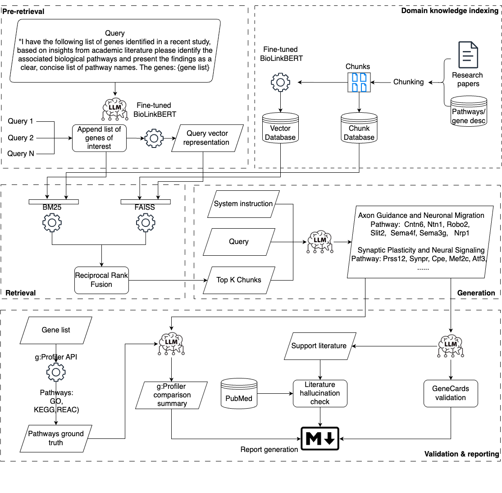

# RAG Pipeline for LUMC


## Table of Contents

1. [Introduction](#introduction)
2. [Features](#features)
3. [Installation](#installation)
   - [Prerequisites](#prerequisites)
   - [Clone the Repository](#clone-the-repository)
   - [Create a Virtual Environment (Recommended)](#create-a-virtual-environment-recommended)
   - [Install Dependencies](#install-dependencies)
4. [Configuration](#configuration)
   - [Configuration Files](#configuration-files)
   - [Key Configuration Parameters](#key-configuration-parameters)
   - [Environment Variables](#environment-variables)
5. [Input and Output](#input-and-output)
   - [Input Directories](#input-directories)
   - [Output Directories](#output-directories)
6. [Running the Application](#running-the-application)
   - [Prepare Your Data](#prepare-your-data)
   - [Execute the Script](#execute-the-script)
   - [Monitoring Execution](#monitoring-execution)
   - [Adding New Data](#adding-new-data)
7. [Troubleshooting](#troubleshooting)
   - [Common Issues](#common-issues)
   - [Logs and Monitoring](#logs-and-monitoring)
8. [Contact](#contact)


## Introduction

The **Modular RAG pipeline for LUMC** is a pipeline designed to facilitate information retrieval from biomedical literature using Retrieval-Augmented Generation (RAG). Leveraging natural language processing (NLP) techniques, embedding models, and efficient search algorithms, this tool provides accurate and relevant responses to user queries. 

The overview of the pipeline can be seen the in the figure below


## Features

- **Query Expansion:** Enhances user queries by generating related terms and synonyms using OpenAI's GPT-4o model
- **Domain knowledge indexing:** Processing, chunking and indexes biomedical literature and gene information for efficient retrieval
- **Hybrid retrieval**: Combines FAISS and BM25, that are ranked, for document ranking and retrieval
- **Response Generation:** Utilizes GPT-o3-mini-high to generate informative and contextually relevant responses using the system instruction, query and retrieved documents


## Installation

### Prerequisites

- Python 3.8 or higher
- **pip** package manager

### Clone the Repository

```bash
git clone https://github.com/mghuibregtse/RAG_LUMC.git
cd RAG_LUMC
```

### Create a Virtual Environment (Recommended)

```bash
python -m venv venv
source venv/bin/activate  # On Windows: venv\Scripts\activate
```

### Install Dependencies

```bash
pip install -r requirements.txt
```
The requirements.txt file contains all the necessary packages for the project. However, some libraries like torch may require specific installation steps based on your system and hardware. Refer to the [PyTorch Installation Guide](https://pytorch.org/get-started/locally/) for detailed instructions. Make sure that [CUDA](https://developer.nvidia.com/cuda-downloads) is installed and configured correctly if you are using a GPU, 

## Configuration

All configurations are managed through JSON files located in the `./configs_system_instruction/` directory.

### Configuration Files

- Default Configuration: `config_template.json`
- GSEA Configuration: `GSEA.json`

### Key Configuration Parameters

- `query`: The user's search question
- `number_of_expansions`: Number of different versions of the query to generate
- `batch_size`: Number of documents to process in each batch
- `model`: Name of the transformer model to use for embeddings (see https://huggingface.co/ for different models.)
- `amount_docs`: Number of top documents to retrieve
- `weight_faiss`: Weight assigned to FAISS scores during ranking
- `weight_bm25`: Weight assigned to BM25 scores during ranking
- `system_instruction_response`: An instruction for the LLM to specify the input, output, structure.

### Environment Variables

Create a `.env` file in the root directory. Depending on which model you'd want to use, add different api keys.
Per different vendor for LLMs, check out the quick start, where you can create your own API key.
- [OpenAI](https://platform.openai.com/docs/quickstart)
- [Gemini](https://ai.google.dev/gemini-api/docs/quickstart?lang=python)
- [Anthropic](https://docs.anthropic.com/en/api/getting-started)

```bash
OPENAI_API_KEY=your_openai_api_key_here
GEMINI_API_KEY=your_gemini_api_key_here
ANTHROPIC_API_KEY=your_anthropic_api_key_here
```

## Input and Output

### Input Directories

- Configuration Files: `./configs_system_instruction/`
- Data Files: `./data/GSEA/external_gene_data` (contains `.gmt.gz` and `.txt.gz` files)
- PDF Documents: `./data/PDF/`

### Output Directories

- Database: `./database/reference_chunks.db` (SQLite database storing document chunks)
- FAISS Index: `./database/faiss_index.bin`
- Logs:
  - `./logs/file_log.json`
  - `./logs/time.txt`
- Responses:
  - `./text_file/tanswer.txt`
  - `./text_file/documents.txt`
  - `./text_file/scores.xlsx`


## Running the Application

### Prepare Your Data

Ensure that your data files are placed in the appropriate directories:
- `.gmt.gz` and `.txt.gz` files in `./data/GSEA/external_gene_data`
- PDF documents in `./data/PDF/`

### Execute the Script

```bash
python your_script_name.py
```

Replace `your_script_name.py` with the actual name of your Python script.

### Monitoring Execution

Execution times for various functions are logged in `time.txt`. Check this file to monitor performance and identify potential bottlenecks.


### Adding New Data
As this current pipeline is build for specific usecases, it can be extended to other usecases by changing the input data. This new input data has to be chunked and processed accordingly fit into the current pipeline.


## Troubleshooting

### Common Issues

Missing Dependencies:
- Ensure all required packages are installed via `pip install -r requirements.txt`
- Some packages like torch may need specific installation commands

API Key Errors:
- Verify that the OpenAI API key is correctly set in the `.env` file
- Ensure that the key has the necessary permissions and is not expired

Data File Issues:
- Confirm that data files are placed in the correct directories
- Check for file corruption, especially for `.gz` and `.pdf` files

Memory Errors:
- Adjust `batch_size` in the configuration to a lower number if encountering memory issues
- Ensure your system has sufficient RAM and, if available, GPU resources

FAISS Index Loading Errors:
- Verify that `faiss_index.bin` exists and is not corrupted
- Ensure that the embedding dimensions match between the model and the FAISS index

### Logs and Monitoring

- Execution Times: Review `time.txt` for function execution times
- Error Messages: Check console outputs for any error messages during execution
- Output Files: Inspect `unknown_genes.txt` and other output files for unexpected content


## Contact

For any questions or support, please contact:

- Name: Mathieu Huibregtse
- Email: mghuibregtse@gmail.com
- [LinkedIn](https://www.linkedin.com/in/mghuibregtse/)
- [GitHub](https://github.com/mghuibregtse)

